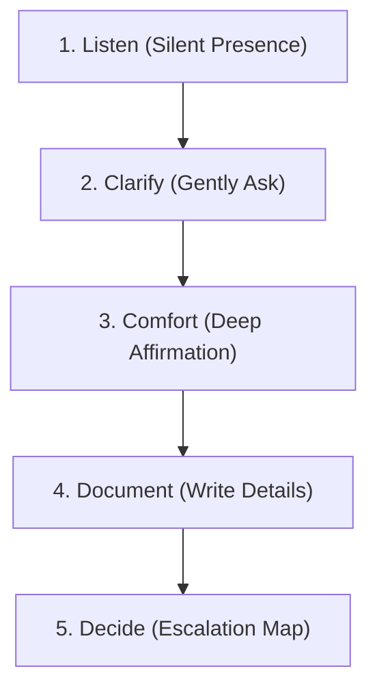

# 💬 Parent Response Scripts
*A Practical Guide to Navigating the First 60 Seconds and Beyond*

When a child gathers the courage to tell a parent they are being mistreated, the parent's initial reaction sets the tone for the entire recovery process. Reaction mistakes (such as panic, immediate anger, or spiritual dismissal) can cause the child to shut down and hide future incidents.

Use these word-for-word response scripts to establish immediate emotional safety, listen deeply, and act with wisdom.

---

## ⏱ The First 60 Seconds
When your child first shares that they are being targeted, your goal is not to solve the problem immediately, but to **anchor their safety**. Keep your voice low, your breathing calm, and repeat these lines:

> [!IMPORTANT]
> **What to Say in the First 60 Seconds:**
> 1. *"I am so glad you told me. Thank you for having the courage to speak up."*
> 2. *"You are not in trouble. None of this is your fault."*
> 3. *"That should not have happened. It is wrong that you had to experience that."*
> 4. *"You are safe now. We are on the same team, and we will figure out our next steps together."*

---

## 🛠 The 5-Step Parent Response Framework

### Step 1: Listen (Silent Presence)
*Let them speak without interruption, advice, or spiritual clichés.*
* **What to say**: 
  * *"Tell me everything that happened. Take all the time you need. I'm just here to listen."*
  * *"How did that make you feel inside?"*
* **What to avoid**: 
  * *"Why didn't you hit them back?"* 
  * *"Well, did you do something to annoy them first?"*

### Step 2: Clarify (Gently Ask)
*Determine the facts without sounding like an interrogator.*
* **What to say**:
  * *"Help me understand: has this happened before with the same person, or is this the first time?"*
  * *"Did anyone else see or hear what happened?"*
  * *"What did the other kids do when it happened?"*
* **What to avoid**:
  * *"Don't worry, they are probably just jealous of you."* (This minimizes the pain).

### Step 3: Comfort (Deep Affirmation)
*Address the emotional and spiritual wound before moving to logistics.*
* **What to say**:
  * *"God made you beautiful, kind, and valuable. Nothing they said or did changes who you are."*
  * *"It is completely okay to feel sad/angry/confused right now. Those are the exact right feelings to have."*
  * *"Let’s look at a Serenity Scroll together for comfort tonight. We don't have to fix this in the next five minutes."*

### Step 4: Document (Write Details)
*Gather objective evidence before memories fade.*
* **What to say**:
  * *"Let's write down the details together so we don't forget anything. This isn't to get anyone in trouble instantly—it's just so we have a clean record of the truth."*
  * *"Can you help me write down: What day was it? What time? What exactly did they say?"*

### Step 5: Decide (Select the Wise Action)
*Apply the 🟢/🟡/🔴 Escalation Map.*
* **What to say**:
  * *"We have a clear path. Since this is [Green / Yellow / Red], here is exactly what we are going to do..."*
  * *(For Yellow)*: *"I am going to send a calm, professional note to your teacher tomorrow to let them know. You are not going to be left alone."*

---

## 📧 Sample Email Template: Contacting the School/Church
*When escalating to a Yellow-level situation, use this template. It is designed to be professional, objective, and collaborative—not defensive.*

**Subject**: Relational Safety Update regarding [Child's Name] - [Grade/Class]

Dear [Teacher's Name / Youth Leader's Name],

I hope you are having a wonderful week. 

I am writing to share some concerns regarding [Child's Name]'s experience recently. [He/She] came to me recently and shared details about repeated incidents involving [other student's name, if known, or general description] that are impacting [his/her] emotional and physical safety. 

To help provide a clear picture, here are the objective details we have documented:
* **[Date/Time]**: [Brief description of incident, e.g., mock teasing on the playground]
* **[Date/Time]**: [Brief description of incident, e.g., repeated exclusion and verbal insults during class group work]

We are working closely with [Child's Name] to practice boundary scripts and emotional regulation at home. However, since these incidents are occurring under your supervision, we would love to collaborate with you to ensure a safe, supportive environment. 

Could we schedule a quick 10-minute phone call or meeting this week to discuss how we can work together to monitor this and keep all students safe?

Thank you so much for your dedication, care, and partnership.

Warmly,

[Your Name]  
[Your Phone Number]
